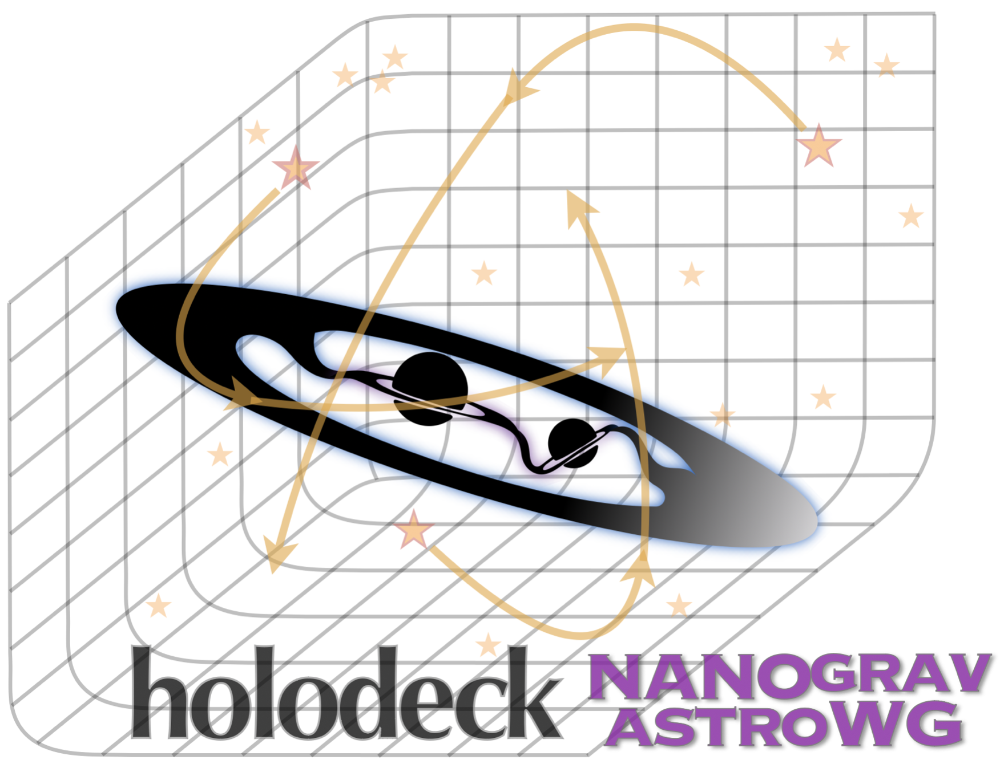

# holodeck

[//]: # (Badges)
[](https://github.com/nanograv/holodeck/actions/workflows/unit-tests-ci.yaml)
[](https://codecov.io/gh/nanograv/holodeck)
[](https://readthedocs.org/projects/holodeck-gw/)

*Massive Black-Hole Binary Population Synthesis for Gravitational Wave Calculations ≋●≋●≋*



This package provides a comprehensive framework for MBH binary population synthesis.  The framework includes modules to perform population synthesis using a variety of methodologies from semi-analytic models, to cosmological hydrodynamic simulations, and even observationally-derived galaxy merger catalogs.

## Getting Started

(1) Read the [getting started guide](https://holodeck-gw.readthedocs.io/en/main/getting_started/index.html).  
(2) Install `holodeck` following the [Installation](#installation) instructions below.
(3) Explore the [package demonstration notebooks](https://github.com/nanograv/holodeck/tree/main/notebooks).


## Installation

The `holodeck` framework is currently under substantial, active development.  It will not be available on `pypi` (`pip`) or via `conda` install until it has stabilized.  Currently `holodeck` requires `python >= 3.9`, and tests are run on versions `3.9`, `3.10`, `3.11`.

Clone the repository first:

```
git clone https://github.com/nanograv/holodeck.git
cd holodeck
```

Then pick one of the two supported install paths.

### Option A — conda/mamba (recommended)

A single [environment.yml](environment.yml) creates an env named `holopy` with all runtime and development dependencies, and installs `holodeck` in editable mode (including its compiled Cython extensions):

```
mamba env create -f environment.yml       # fast; use `conda` if you prefer
mamba activate holopy
```

If needed, the installation can also be performed with `conda`, however it is much slower 
to install. In some shells, the environment creation with mamba works but the environment activation
with mamba does not. In this case, run

```
conda activate holopy
```

instead.

If you later edit a `.pyx` file, rerun `pip install -e . --no-deps` to rebuild the C extensions.

### Option B — pip (legacy workflow)

Recommended if you already have a Python env and want to stay on pip. Equivalent to the historical setup:

```
# optional: isolate with conda
conda create --name holo310 python=3.10 && conda activate holo310

pip install -r requirements.txt
pip install -r requirements-dev.txt       # optional, for development
python setup.py build_ext -i
python setup.py develop
```

The 'editable' installation allows the code base to be modified, and have those changes take effect when using the `holodeck` module without having to rebuild/reinstall it.

### MPI (optional, either path)

For some scripts (particularly for generating libraries), an MPI implementation is required (e.g. `openmpi`), along with the [`mpi4py` package](https://github.com/mpi4py/mpi4py).  This is not included by default as it significantly increases the installation complexity, and is not needed for many `holodeck` use cases.

- conda/mamba: `mamba install mpi4py` inside the activated `holopy` env
- homebrew (macOS): `brew install mpi4py` ([includes openmpi](https://mpi4py.readthedocs.io/en/latest/install.html#macos))
- pip: install an MPI implementation system-wide, then `pip install mpi4py`

To see if you have `mpi4py` installed, run `python -c 'import mpi4py; print(mpi4py.__version__)'` from a terminal.


## Quickstart

(1) Read the [Getting Started Guide](https://holodeck-gw.readthedocs.io/en/main/getting_started/index.html).  
(2) Explore the [package demonstration notebooks in `holodeck/notebooks`](https://github.com/nanograv/holodeck/tree/main/notebooks).


## Documentation

Full package documentation for `holodeck` is available on [readthedocs](https://holodeck-gw.readthedocs.io/en/main/).


## Contributing & Development

Contributions are not only welcome but encouraged, anywhere from new modules/customizations to bug-fixes to improved documentation and usage examples.  Please see [Development & Contributions](https://holodeck-gw.readthedocs.io/en/main/development.html).

## Copyright

Copyright (c) 2024, NANOGrav

The `holodeck` package uses an [MIT license](./LICENSE).


## Attribution & Referencing

A dedicated paper on ``holodeck`` is currently in preparation, but the package is also described in the recent [astrophysics analysis from the NANOGrav 15yr dataset](https://ui.adsabs.harvard.edu/abs/2023ApJ...952L..37A/abstract).


   ```tex
   @ARTICLE{2023ApJ...952L..37A,
         author = {{Agazie}, Gabriella and {et al} and {Nanograv Collaboration}},
         title = "{The NANOGrav 15 yr Data Set: Constraints on Supermassive Black Hole Binaries from the Gravitational-wave Background}",
         journal = {\apjl},
            year = 2023,
         month = aug,
         volume = {952},
         number = {2},
            eid = {L37},
         pages = {L37},
            doi = {10.3847/2041-8213/ace18b},
   archivePrefix = {arXiv},
         eprint = {2306.16220},
   primaryClass = {astro-ph.HE},
         adsurl = {https://ui.adsabs.harvard.edu/abs/2023ApJ...952L..37A},
   }
   ```
